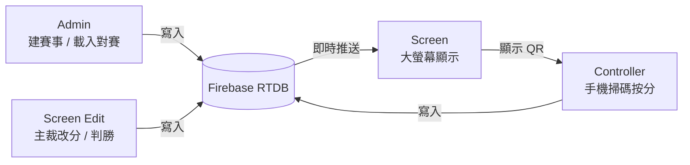

# TKD Scoreboard — 跆拳道計分系統

## Hero

**TKD Scoreboard**

| | 中文 | English |
|---|------|---------|
| **Headline** | 場上即時計分，多裝置同步開波。 | Live court scoring. Every device in sync. |
| **Subcopy** | Admin 建賽載入、大螢幕顯示、手機掃碼按分——經 Firebase 即時同步，全場同一分數。 | Admins load the match, the Screen runs the board, judges score from their phones—synced in realtime over Firebase. |
| **CTA** | 開始設定場地　｜　了解點運作 | Set up a court　｜　See how it works |

---

## 一句過（Product blurb）

**中文：**  
TKD Scoreboard 係純前端嘅跆拳道即時計分網頁：Admin 建 Event／Court、載入 Match；大螢幕顯示分數同計時；裁判用手機掃 QR 搶席按分。所有改動經 **Firebase Realtime Database (即時資料庫)** 同步，同一場地多裝置即時一致。多裁判時約 1 秒內要有足夠同意先加分；主裁亦可喺螢幕處理 Technical Card (技術警告牌) 同判勝。

**English：**  
**TKD Scoreboard** is a frontend-only live taekwondo scoring web app: admins create an Event/Court and load Matches; the big Screen shows score and clock; judges scan a QR code on their phones, claim a seat, and score. Every change syncs through **Firebase Realtime Database**, so all devices on the same court stay in lockstep. In multi-judge mode, enough judges must agree within about one second before a point counts; the center referee can also handle Technical Cards and decide the winner from the Screen.

---

## 運作原理（任何人一睇就明）

**TKD Scoreboard（跆拳道即時計分板）係一個純前端網頁：冇獨立伺服器程式，所有裝置透過 Firebase Realtime Database (即時資料庫) 同步同一場賽事。**

現場大致分三角色、四個畫面：

1. **Admin (管理員)** — Google 登入 → 建立 Event (賽事) 同 Court (場地) → 用 PDF／手動匯入 Match (對賽) → 將某場 Load 到指定場地。
2. **Screen (大螢幕)** — 顯示紅藍分數、計時、勝敗；主裁可開 Edit 改分、判勝、處理 Technical Card；可出 QR Code 俾裁判掃。
3. **Controller (手機遙控)** — 裁判掃 QR 進場，搶 J1–J3 席位後按掣加分（+1／+2／+3／+4／+6）；斷線自動讓座。

**計分點樣「成真」：** 按掣寫入 Firebase；同一 Court 嘅大螢幕同其他裝置即時跟住變。Single Mode (單裁判) 一按即加；Multiple Mode (多裁判) 約 1 秒內至少兩位裁判投同一分先加。系統亦會按規則自動判斷 PTG (分差勝)／PUN (犯規勝) 等。

**一句總結：** 管理員揀場同載入對賽 → 大螢幕開波同顯示 → 手機裁判掃碼計分 → Firebase 即時同步到全場。

### 資料流



```
Admin ──寫入──┐
Controller ──┤──► Firebase RTDB ──推送──► Screen（大螢幕）
Edit（主裁）─┘         ▲
                       │
              Screen 出 QR ──掃碼──► Controller
```

> 多裝置同步、資料庫 schema、搶位細節 → [`docs/FIREBASE_MULTI_DEVICE_DESIGN.md`](docs/FIREBASE_MULTI_DEVICE_DESIGN.md)

---

## 產品組件 (Key Features)

歡迎來到你的專屬跆拳道賽事 DIY 組裝包！呢個 **Frontend-only (純前端)** 系統為觀眾、賽事管理員同邊線裁判提供「一啪即合」嘅體驗——一個 Google 帳號、一部手機，開波！

* **Live Scoreboard (大螢幕)**：Firebase 實時同步；玻璃質感 QR Code；HKTKDA PDF 自動解析 Match 同選手
* **Mobile Controller (手機遙控)**：免裝 App；Transaction 搶 J1–J3 席位，斷線自動讓座；Multiple Mode 下 2+ 裁判 **1 秒內**同分先加
* **Technical Card (技術警告牌)**：主裁 Edit 確認 → Firebase 同步公告 glass card 到**同一場地所有 Screen**（3 秒；Reject 延遲 Gam-jeom +1）
* **Admin (管理後台)**：Toast / Modal 取代醜樣 Alert；Delete 只刪單場 Match；淘汰樹狀圖自動排版晉級路徑

---

## 點樣運作 (How It Works) — 現場細節

### 現場七步曲

```
Court Setup → Data Import (Load Match) → Screen 開波 (Space 計時, Q 出 QR)
→ Controller 掃碼搶位 → Firebase 同步計分 → Edit 判勝 / REST → Promote Winner 晉級
```

| 路由 | 做咩 |
|------|------|
| `/court-setup` | Google 登入、建 Event、揀 Court |
| `/` | Home 導航 |
| `/screen` | 大螢幕；`E` 開 Edit 主裁面板 |
| `/controller` | 邊裁遙控（可經 QR `?event=&court=` 直入） |
| `/import` | Match 管理、Load 到 Court、Bracket |

**Session**：Court Setup 後 `{ eventId, courtId }` 存入 `sessionStorage`；`ProtectedRoute` 守護其餘路由。

**計分**（`src/Api.js`）：Single Mode 一按即加；Multiple Mode 靠 `votes` + `VOTE_WINDOW_MS = 1000`；自動 PTG / PUN；REST 禁改分。Controller 六掣對應 `pointsStat[0–4]` → +1 / +2 / +3 / +4 / +6 分。

**搶位**（`Controller.jsx`）：`runTransaction` 試 J1→J3 → `onDisconnect().remove()`；Paused 禁畀分；Google Admin 唔佔席位。

**Load Match**：寫入 `courts/{courtId}/currentMatchId`，Screen / Controller 即時跟住變。

**Technical Card**：主裁喺 Edit 按 Accept/Reject → `state.techCardAnnouncement` 寫入 Firebase → 同 Court 所有 `/screen` 顯示 3 秒 glass card → `finalizeTechCardAnnouncement` 清除（Reject 先加 Gam-jeom）。

---

## 組裝說明 (Tech Stack & Commands)

| 零件 | 技術 |
|------|------|
| 層板 | React 18, Vite, React Router v6 |
| 鉸鏈 | Firebase Realtime Database + Google Auth（**冇 backend server**） |
| 漆油 | Vanilla CSS, Glassmorphism, `cqi` |
| 說明書翻譯機 | pdfjs-dist |

部署：**GitHub Pages**，`base: '/TKD-scoreboard/'`。計分大腦 → `src/Api.js`；Firebase → `src/firebase.js`。

```bash
npm install && npm run dev    # 試裝
npm run build && npm run deploy   # 装箱上架
npm run lint                  # 检查螺丝
```

---

## 邊度放咩 (Source Map)

| 檔案 | 做咩 |
|------|------|
| `src/App.jsx` | 路由 |
| `src/Api.js` | 計分、回合、晉級 |
| `src/firebase.js` | Firebase 初始化 |
| `src/Context/AuthContext.jsx` | 登入 + session |
| `src/Context/PopupContext.jsx` | Toast / Modal |
| `src/Pages/CourtSetup/` | 建 Event、PDF 匯入 |
| `src/Pages/DataImport/` | Match CRUD、Load、Bracket |
| `src/Pages/Home/` | 入場後導航 |
| `src/Pages/Screen/Screen.jsx` | 大螢幕 |
| `src/Pages/Screen/Edit.jsx` | 主裁改分、Technical Card 確認 |
| `src/Pages/Controller/` | 邊裁搶位、遙控 |
| `src/Components/QRCodeDisplay/` | QR、裁判模式 |
| `src/Components/TechnicalCardFlow/` | Technical Card 確認 + 公告 glass card |
| `src/Utils/pdfParser.js` | HKTKDA PDF 解析 |
| `database.rules.json` | 安全規則 |

**改 UI**：一元件一 CSS，用 `.aurora-bg` + `.glass-card`。**唔好改 `dist/`**。

---

## 給 AI 同開發者 (Agents & Devs)

人類同機械人睇同一份說明書就夠。加功能優先改 `src/Pages` / `src/Components`；改 Firebase schema 要連 Screen、Controller、Api 一齊諗。

| 症狀 | 先睇 |
|------|------|
| 分數 / 規則錯 | `Api.js` |
| 大屏 ⟷ 手機唔同步 | `Screen.jsx` + `Controller.jsx` |
| 搶位 / 斷線 | `Controller.jsx` |
| QR / 裁判人數 | `QRCodeDisplay.jsx` |
| Technical Card 公告 | `TechnicalCardFlow/`、`Api.js`、`Screen.jsx` |
| PDF / Match | `DataImport.jsx`, `pdfParser.js` |
| Event 建刪 | `CourtSetup.jsx` |

---

## 安全 · 未入盒 · 延伸

**Court-level Locking**：坐正 J1–J3 嘅 `deviceId` 先改分；Admin 靠 Google auth；Event 靠建立者。詳見 [`database.rules.json`](database.rules.json)。

**計劃中**：Persistent Token 重連、hostStatus 離線警示、**IVR**（[`TODO_WT2026.md`](TODO_WT2026.md)）

**已實作（WT 2026）**：Technical Card — 見 [`TODO_WT2026.md`](TODO_WT2026.md#technical-card已實作)

**深入閱讀**：[`FIREBASE_MULTI_DEVICE_DESIGN.md`](docs/FIREBASE_MULTI_DEVICE_DESIGN.md) · [`TODO_WT2026.md`](TODO_WT2026.md) · [`package.json`](package.json)

---

*設計於香港，組裝於互聯網。MIT License.*
