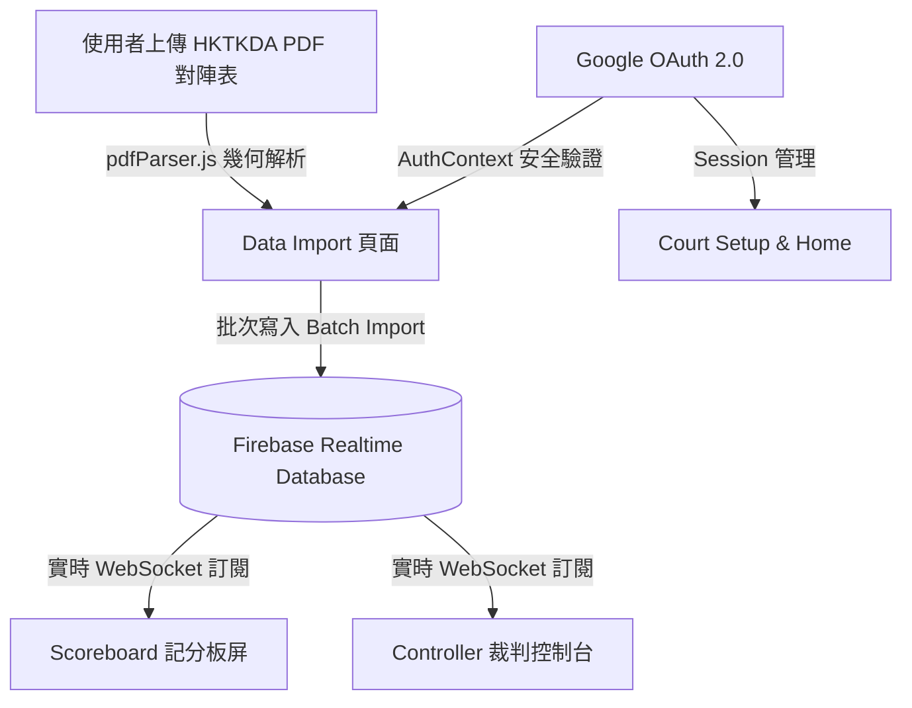

# 🥋 WT 跆拳道即時計分與賽程管理系統 (Taekwondo Scoreboard & Tournament System)

本系統為專為跆拳道賽事設計之現代化 Web 實時記分與賽程管理平台。系統採用 **Serverless Realtime Architecture (無伺服器實時架構)**，結合前端智能解析技術，支援一鍵導入 HKTKDA (香港跆拳道協會) 官方 PDF 對陣表賽程，支援多台裝置實時同步。

---

## 🚀 測試與起動指南 (Quick Start Guide)

### 第一步：啟動系統 (Frontend & Firebase)
在終端機中執行以下指令啟動本地開發伺服器：
```powershell
npm run dev
```
啟動成功後，瀏覽器開啟 `http://localhost:5173/TKD-scoreboard/`。

### 第二步：多螢幕角色模擬
在瀏覽器開啟多個分頁或視窗，體驗零延遲實時同步：

| 頁面角色 | 網址 / 路徑 | 功能說明 |
| :--- | :--- | :--- |
| **主頁 (Home)** | `/` | 賽事狀態卡片、Google 登入/登出重定向、選單導航 |
| **場地設定 (Court Setup)** | `/court-setup` | 設定當前裝置對應之場地 (Court ID) 與目標賽事 |
| **數據匯入 (Data Import)** | `/import` | 上傳 HKTKDA PDF 賽程、幾何解析、Sub-Events 拆分、賽事寫入 Firebase |
| **實時記分板 (Scoreboard)** | `/scoreboard` | 裁判與觀眾大螢幕，實時同步分數、犯規 (Gam-jeom)、Timer 與回合勝負 |
| **裁判控制台 (Controller)** | `/controller` | 場上主審或手掣控制介面，即時手動加減分與比賽控制 |

---

## 🛠️ 技術架構 (Technical Architecture)



### 技術棧 (Technology Stack)
- **前端框架 (Frontend Framework)**: React 18 + Vite
- **實時數據庫 (Realtime Database)**: Firebase Realtime Database (RTDB)
- **身份驗證 (Authentication)**: Google OAuth 2.0 (`@react-oauth/google` + Firebase Auth)
- **PDF 解析引擎 (PDF Parser)**: `pdfjs-dist` (幾何方框聚類算法)
- **視覺與動效 (Styling & Design)**: Vanilla CSS + Pure Yellow `#FFFF00` 主題 + Dynamic Canvas Grid (`Squares.jsx`)

---

## 🗄️ Firebase 數據庫結構 (Realtime Database Schemas)

數據庫以 `events` 為根節點，結構規範如下：

```json
{
  "events": {
    "{eventId}": {
      "EventName": "2026 全港跆拳道錦標賽",
      "createdBy": "user_uid_123456",
      "createdByEmail": "admin@example.com",
      "createdAt": 1785828600000,
      "matchDate": "16/5/2026",
      "settings": {
        "setupPassword": "BCB2026"
      },
      "courts": {
        "{courtId}": {
          "name": "court1",
          "currentMatchId": "A1001"
        }
      },
      "matches": {
        "{matchId}": {
          "config": {
            "matchId": "A1001",
            "nextMatchId": "A1005",
            "nextMatchSlot": "blue",
            "categoryTitle": "男子 FEATHER 羽量級 男子組 B組 51-55公斤",
            "matchDate": "16/5/2026",
            "courtCode": "A1",
            "rules": {
              "maxGamjeom": 5,
              "maxPointGap": 15,
              "roundDuration": 120,
              "restDuration": 60
            },
            "competitors": {
              "blue": {
                "name": "何頌賢",
                "affiliatedClub": "香港胡氏跆拳道會",
                "previousMatch": null
              },
              "red": {
                "name": "李承浩",
                "affiliatedClub": "香港胡氏跆拳道會",
                "previousMatch": null
              }
            }
          },
          "state": {
            "isStarted": false,
            "isPaused": true,
            "isFinished": false,
            "currentRound": 1,
            "timer": 120,
            "winnerSide": null,
            "phase": "ROUND",
            "winReason": null
          },
          "stats": {
            "roundWins": { "red": 0, "blue": 0 },
            "blue": { "pointsStat": [0, 0, 0, 0, 0], "gamjeom": 0 },
            "red": { "pointsStat": [0, 0, 0, 0, 0], "gamjeom": 0 }
          }
        }
      }
    }
  }
}
```

---

## 📄 HKTKDA PDF 賽程解析引擎 (PDF Parsing Engine)

[pdfParser.js](file:///c:/Users/cyche/Document/TKD-scoreboard/src/Utils/pdfParser.js) 使用 **Geometric Box Grouping (幾何方框聚類算法)** 解析香港跆拳道協會 PDF 表格：

1. **人名與屬會精確分離 (Name & Club Separation)**:
   - 屬會名稱位置：`X <= 100` (如 `香港胡氏跆拳道會` 或多行換行 `國際跆拳道香港總` + `會`)
   - 選手姓名位置：`X > 100` (如 `何頌賢` 或英文姓名 `THAPA, NISHCHAL`)
2. **藍紅方位置判定 (Top = Blue, Bottom = Red)**:
   - 比賽編號 (如 `A1004`) Y 座標為 `MatchY`
   - 選手 Y 座標 `<= MatchY` 判定為 **Blue (藍方)**
   - 選手 Y 座標 `> MatchY` 判定為 **Red (紅方)**
3. **跨日賽事拆分 (Multi-Day Sub-Events)**:
   - 自動提取每頁右上角日期 (如 `16/5/2026`, `31/5/2026`)，支援依據日期自動拆分建立多個 Sub-Events 子賽事。

---

## ⚖️ 2026 最新跆拳道規則與邏輯 (Rules & Enforcement)

- **得分分差門檻 (Max Point Gap / PTG)**: 15 分 (單局分差達 15 分自動結束該局)。
- **犯規門檻 (Max Gam-jeom / PUN)**: 5 次 (單局犯規達 5 次判定該局落敗)。
- **回合時間 (Round Duration)**: 120 秒 (2 分鐘)。
- **局間休息 (Rest Duration)**: 60 秒 (1 分鐘)。
- **得分價值 (Point Values)**:
  - 正拳 (Punch) = 1 分
  - 軀幹 Kick (Body Kick) = 2 分
  - 轉身軀幹 Kick (Turning Body Kick) = 4 分
  - 頭部 Kick (Head Kick) = 3 分
  - 轉身頭部 Kick (Turning Head Kick) = 6 分
  - 對方 Gam-jeom (Penalty) = 1 分
