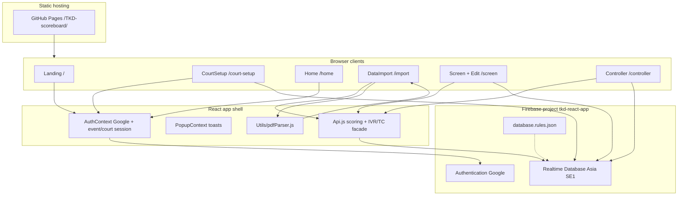
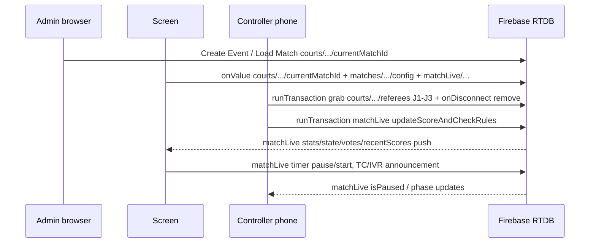
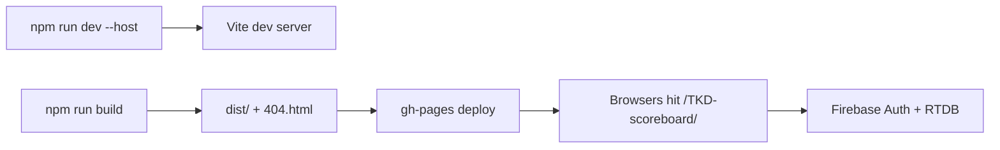

# System Design（系統設計）

**Product:** Taekwondo Cloud Scoring System  
**Architecture style:** Frontend-only SPA + Firebase BaaS（Backend as a Service）  
**Document status:** Reverse-engineered from source  
**Last reviewed against code:** 2026-08-12

> **Codebase baseline:** flat RTDB schema（`eventIndex`／slim `events`／`courts`／`matches/…/config`／`matchIndex`／`matchLive`）。計分／席位細節以 `src/` 同 [`FIREBASE_MULTI_DEVICE_DESIGN.md`](./FIREBASE_MULTI_DEVICE_DESIGN.md) 為準。扁平化紀錄 → [`FIREBASE_FLATTENING_PLAN.md`](./FIREBASE_FLATTENING_PLAN.md)。  
> **用語：** Technical Card 中文一律「技術卡」；文中 **TC** = Technical Card（技術卡）。雙語標籤用 `English（中文）`。

> 標 **`[待確認]`** = 未能由程式完全證實。  
> 若同 [`FIREBASE_MULTI_DEVICE_DESIGN.md`](./FIREBASE_MULTI_DEVICE_DESIGN.md) 衝突，**以現行 `src/` 為準**。

---

## 1. Goals of this design（設計目標）

1. **低摩擦現場部署**：瀏覽器即可；邊裁掃 QR，無須安裝 App。  
2. **多裝置強一致感**：同一 Court 嘅 Screen／Edit／Controller 訂閱同一 Match。  
3. **無自建 server**：計分／回合邏輯喺 client 用 `runTransaction` 執行；授權靠 RTDB Rules。  
4. **可維護性**：規則／計分已抽部分純模組（`src/domain/`、`src/services/`）；頁面仍負責 Firebase I/O。

---

## 2. Technology stack（技術棧）

| Layer | Choice | Version（`package.json`） | Role |
|-------|--------|---------------------------|------|
| UI | React + React DOM | `^19.1.0` | SPA components |
| Bundler / Dev | Vite | `^5.2.0` | Dev server + production build |
| Routing | React Router DOM | `^7.7.1` | Client routes；`basename=/TKD-scoreboard` |
| Auth | Firebase Auth（Google popup） | `firebase ^12.8.0` | Admin identity |
| Data | Firebase Realtime Database | same | Live sync + transactions |
| PDF | `pdfjs-dist` | `^3.11.174` | HKTKDA drawsheet parse |
| QR | `qrcode.react` | `^4.2.0` | Controller deep-link |
| Motion / FX | `gsap`, `ogl` | — | Landing／視覺效果 |
| Test | Vitest | `^2.x`（見 `package.json`） | Unit tests：`npm test` |
| Deploy | `gh-pages` | `^6.3.0` | GitHub Pages；`base: '/TKD-scoreboard/'` |
| Style | Vanilla CSS | — | Per-page CSS；glass／aurora patterns |

**Explicitly absent:** Express／Fastify、REST controllers、GraphQL、Cloud Functions（repo 內未見）。

**Config note:** Firebase web config 硬編碼於 `src/firebase.js`；**無** `.env`／`VITE_*` 分離 → 運維上要小心洩漏同輪替 → `[待確認]` 是否計劃改為環境變數。

---

## 3. System architecture（系統架構圖）



### 3.1 Runtime data flow（運行時資料流）



---

## 4. Module dependency map（模組依賴）

### 4.1 Top-level layout

```
src/
├── App.jsx                 # Providers + Routes
├── firebase.js             # app / auth / database init
├── Api.js                  # Thin Firebase wrappers (scoring, rounds, IVR, TC, promote)
├── domain/                 # Pure scoring / rules helpers
├── services/               # RTDB path helpers + court/match I/O
├── Context/
│   ├── AuthContext.jsx
│   ├── EventSessionContext.jsx
│   └── PopupContext.jsx
├── Pages/                  # Route-level UI
├── Components/             # Shared UI (QR, DecisionFlow, Bracket, …)
└── Utils/pdfParser.js      # HKTKDA PDF parse
```

### 4.2 Dependency rules（建議邊界）

| From → To | Allowed? |
|-----------|----------|
| Pages → Api / Context / Components / Utils | Yes |
| Api → firebase | Yes |
| Components → Api（DecisionFlow finalize 等） | Yes（現況） |
| 未來 `domain/` 純模組 → firebase | **應禁止**（建議） |

### 4.3 Key page collaborations

| Page | Reads session | Writes Firebase（典型） | Notes |
|------|---------------|-------------------------|-------|
| CourtSetup | Clears event session on mount | Create／delete events；courts map | Requires Google user |
| Home | event + court | Mostly navigation／QR | — |
| DataImport | event + court | Match CRUD、Load `currentMatchId`、bracket | Large page |
| Screen | event + court | Timer、listeners、announcements | Hosts Edit |
| Controller | session **or** URL `event`/`court` | Seat grab、score transactions | QR params 可寫入／補齊 `AuthContext` session |

---

## 5. Client routing（應用路由）

| Path | Component | Guard |
|------|-----------|--------|
| `/` | Landing | Public；已 Google 登入 → navigate `/court-setup` |
| `/court-setup` | CourtSetup | 需已 Google 登入，否則 `<Navigate to="/" />`；Google CTA 只喺 Landing |
| `/home` | Home | `ProtectedRoute`（event+court session） |
| `/screen` | Screen（含 Edit） | `ProtectedRoute` |
| `/controller` | Controller | `ProtectedRoute`；URL query 可建立／補齊 session |
| `/import` | DataImport | `ProtectedRoute` |
| `*` | → `/` | — |

**Session keys**（`sessionStorage`）：`selectedEvent`、`selectedCourt`、`selectedEventName`。  
無 event/court session → `/`（Landing）；已登入用戶會由 Landing 自動轉去 `/court-setup`。

---

## 6. Database schema（資料庫綱要）

**Database URL:** `https://tkd-react-app-default-rtdb.asia-southeast1.firebasedatabase.app`（見 `src/firebase.js`）

### 6.1 Tree（flat；2026-08 production）

完整說明 → [`FIREBASE_MULTI_DEVICE_DESIGN.md`](./FIREBASE_MULTI_DEVICE_DESIGN.md) §3。

```
eventIndex/{eventId}/                 ← list summary
events/{eventId}/                     ← meta + settings only
├── EventName, createdBy, createdByEmail, matchDate?
├── coAdmins?                         ← rules 支援；UI 寫入 [待確認]
└── settings/
    ├── setupPassword
    ├── maxPointGap, maxGamjeom, roundDuration, restDuration
    └── ivrQuota?                     ← empty ⇒ WT unlimited

courts/{eventId}/{courtId}/
├── name, currentMatchId
├── config.refereeMode                ← "single" | "multiple"
└── referees/J1|J2|J3                 ← { deviceId, deviceName, lastSeen } or absent

matches/{eventId}/{matchId}/config/   ← static schedule
├── matchId, competitors.{red,blue}
├── rules { …, ivrQuota? }
└── nextMatchId, nextMatchSlot

matchIndex/{eventId}/{matchId}/       ← bracket／list summary

matchLive/{eventId}/{matchId}/        ← live scoring／timer (primary)
├── state/   timer, phase, announcements, kyeShi, …
├── stats/   pointsStat, gamjeom, roundWins, …
├── votes[]?, recentScores[]?
├── providedCourtId?, providedDeviceId?
└── updatedAt
```

### 6.2 Scoring model

| `pointsStat` index | Points | Meaning |
|--------------------|--------|---------|
| 0 | +1 | Punch |
| 1 | +2 | Body |
| 2 | +3 | Head |
| 3 | +4 | Turning Body |
| 4 | +6 | Turning Head |

```
sideScore = Σ(pointsStat[i] × weight[i]) + opponent.gamjeom + opponent.gamjeomAvoiding
```

**winReason:** `PUN` | `PTG` | `PTF`（及其他 UI 顯示值以程式為準）。

### 6.3 Security rules summary（`database.rules.json`）

| Path | Read | Write |
|------|------|-------|
| `eventIndex`／`events`／`courts`／`matches`／`matchLive`／`matchIndex` | `true`（公開讀） | 見下 |
| `events/{id}` | — | Auth + creator／`coAdmins`；root **禁** `courts`／`matches` children |
| `courts/.../referees/$judgeId` | — | Auth **或** 同 `deviceId` 搶位／清 `null`（要有 `deviceId`） |
| `matchLive/.../{matchId}` | — | Auth **或** 已有節點 + `providedDeviceId` 對應 flat J1–J3 |
| `matches/.../config`、`matchIndex` | — | Auth owner／coAdmin（或 orphan 清理） |

**Implication:** 未登入邊裁可以寫 `matchLive`（經 flat 席位 device 綁定）；任何人可讀公開樹。

---

## 7. Cross-cutting behaviours（橫切行為）

| Concern | Mechanism |
|---------|-----------|
| Server clock for votes | `.info/serverTimeOffset` → `voteNow` |
| Timer pause on PUN／PTG | `pauseNow = Date.now()`（同 vote clock **刻意分開**） |
| Seat cleanup | `onDisconnect(seatRef).remove()` |
| StrictMode double-mount | Controller seat grab **400ms** delay（preserve） |
| Multi-screen TC／IVR finalize | Transaction delete announcement；reject TC → +1 gamjeom once |
| Google stale session | `AUTH_SESSION_KEY` workaround in AuthContext |

---

## 8. Deployment architecture（部署）



| Item | Value |
|------|-------|
| Live demo | `https://cy-cheung.github.io/TKD-scoreboard/` |
| Vite `base` | `/TKD-scoreboard/` |
| Router `basename` | `/TKD-scoreboard` |
| Firebase Hosting config | `firebase.json` 存在；**主要文件／scripts 指向 gh-pages** → 是否雙軌部署 `[待確認]` |

---

## 9. Risks & open questions

1. Client-side transaction logic 可被篡改；真正防線係 Rules（粒度有限）。  
2. `.read: true` 令賽事資料公開。  
3. `coAdmins`、Firebase Hosting 實際使用情況 → `[待確認]`。  
4. IVR／TC 同最新 WT 條文一致性 → 見 `TODO_WT2026.md`，`[待確認]`。

---

## 10. Document history

| Date | Change |
|------|--------|
| 2026-08-10 | Initial system design from repository reverse engineering |
