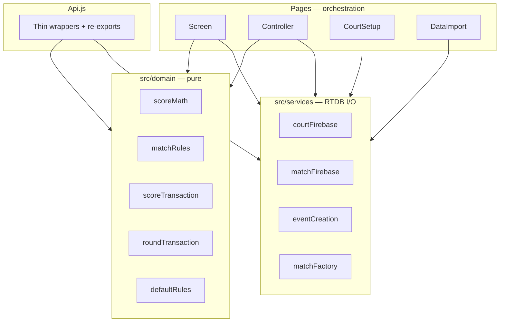

# Refactoring Plan — TKD Scoreboard

> **Status:** Phase 2 Waves 0–8 **complete**. Firebase RTDB flatten **complete**（另軌；見 [`FIREBASE_FLATTENING_PLAN.md`](./FIREBASE_FLATTENING_PLAN.md)）。  
> **Clean-code branch（歷史）：** `cursor/clean-code-refactor-8215`  
> **Flatten stack tip：** `cursor/firebase-docs-prd-system-8215` 等（PR #19–#26+）  
> **Completed waves：**  
> - Wave 0: Vitest + `npm test`  
> - Wave 1: `defaultRules` / `scoreMath` / `matchRules` → `Api` / `Screen` / `Edit`  
> - Wave 2: `matchFactory` / `eventCreation` → `CourtSetup` / `DataImport` / `pdfParser`  
> - Wave 3: Controller score-pad/params; Edit grid pieces; DecisionFlow Confirm + announcement timing  
> - Wave 4: Screen `formatTime` / `voteLogUtils` / `VoteLogRows`（timer rAF / Firebase listeners 仍喺 page）  
> - Wave 5: `AuthContext`（Google）+ `EventSessionContext`（event/court）  
> - Wave 6: `scoreTransaction` / `roundTransaction` pure bodies；`Api` thin wrappers（**voteNow vs pauseNow** 兩套 clock 保留 — 唔係 RTDB dual-write）  
> - Wave 7: Screen `matchTimer` pure helpers；rAF + Firebase I/O 留喺 `Screen.jsx`  
> - Wave 8: Controller `seatGrab` helpers；Firebase orchestration 留喺 page  

本文係 Clean Code 計劃 + 完成紀錄。可選後續見 §10。

---

## 0. Baseline facts（2026-08-12）

| Item | Status |
|------|--------|
| Source | ~88 JS/JSX under `src`（含 tests） |
| Unit tests | **25** files · **157** tests · `npm test`（Vitest） |
| `package.json` scripts | `dev` / `build` / `lint` / `preview` / `test` / deploy |
| RTDB layout | Flat：`eventIndex`／slim `events`／`courts`／`matches/…/config`／`matchIndex`／`matchLive` |
| Complexity metric（歷史） | Decision-point heuristic 用嚟排 Phase 1 hotspots |

---

## 1. Phase 1 hotspot inventory（歷史快照）

以下 LOC／CC 係 **2026-08-10** 掃描數字，留作對照；而家頁面仍偏大，但 domain／services 已抽走。

| Rank | File（當時） | ~LOC | Primary smells（當時） |
|------|--------------|------|------------------------|
| 1 | `Screen.jsx` | ~787 | God component；timer + listeners + vote UI |
| 2 | `Api.js` | ~447 | 長 transaction；defaults／weights／IVR／TC 混一檔 |
| 3 | `DataImport.jsx` | ~912 | Create Event + PDF + CRUD + bracket |
| 4 | `CourtSetup.jsx` | ~821 | Auth + session + Create Event／PDF 重複 |
| 5 | `Controller.jsx` | ~430 | Seat grab + score pad 重複 |

### 當時 Wave 2 候選

- `Edit.jsx` — mirrored blue/red UI  
- `pdfParser.js` — defaults 第三份  
- IVR／TC Confirm + Announcement 近似重複  
- `AuthContext` — Google vs event session 耦合  

---

## 2. Cross-cutting map（目標架構 — 已大致落地）

### Risk grades（仍適用）

| Grade | Zone | Handling |
|-------|------|----------|
| **P0** | `Api`／`matchLive` TX、Screen timer、Controller seat | 改語義前要有測試 + smoke |
| **P1** | IVR／TC finalize、whole-event `set`／`remove` | Regression checklist |
| **P2** | UI DRY、page 再拆 | 允許；仍要 smoke |

---

## 3. Guiding principles（Clean Code）

1. **SRP** — UI／domain／Firebase I/O 分開。  
2. **DRY** — defaults、score math、create-event 單一來源。  
3. **Small steps** — 一次一個薄模組；每次改完跑 `npm test`。  
4. **Preserve edge logic** — 400ms seat delay、vote window、last-10s avoiding、`AUTH_SESSION_KEY` 等。  
5. **Circuit breaker** — 同一模組連續 fail >2 → stop、`git restore`、報告。

---

## 4. Phase 2 waves（已完成）

詳細步驟保留作歷史；狀態一律 **Done**。

| Wave | Summary | Status |
|------|---------|--------|
| 0 | Vitest + `npm test` | Done |
| 1 | `domain/defaultRules`／`scoreMath`／`matchRules` | Done |
| 2 | `eventCreation`／`matchFactory` | Done |
| 3 | Controller／Edit／DecisionFlow UI extracts | Done |
| 4 | Screen vote log／formatTime | Done |
| 5 | Auth vs EventSession split | Done |
| 6 | score／round transaction pure extract | Done |
| 7 | `matchTimer` pure extract | Done |
| 8 | `seatGrab` pure extract | Done |

**Explicitly deferred（仍有效）：** 唔好無測試下重寫 `matchLive` TX 語義、timer rAF 狀態機、seat `onDisconnect` 次序／delay。

---

## 5. Per-file end state（而家）

| File | Direction |
|------|-----------|
| `Screen.jsx` | Orchestration：listeners + rAF；rules／timer decisions → domain／`matchTimer` |
| `Api.js` | Thin facade → domain + `matchFirebase`（`updateMatchLive*`） |
| `DataImport.jsx`／`CourtSetup.jsx` | 用 `eventCreation`／`matchFactory`／flat services |
| `Controller.jsx` | `seatGrab` + flat `courts/.../referees`；score pad 已抽 |
| `services/*` | Flat paths only（無 `legacy*` helpers） |

---

## 6. Success criteria

- [x] `npm test` green（157 passing @ 2026-08-12）  
- [x] `npm run build` green（Pages deploy 常用）  
- [x] Domain／services 抽離；Top 頁面仍可再瘦（可選）  
- [x] Scoring／seat／PDF create 行為有單元測試 + 現場 smoke  
- [x] 已知 edge workaround 保留  
- [x] RTDB flatten complete（production export verified）

---

## 7. Circuit breaker procedure

1. 同一模組 **> 2** 連續 test fail，或不可恢復依賴錯誤 → **Stop**。  
2. `git restore` 受影響檔（或 revert 該 slice）。  
3. 報告：failure signature、原因、下一步選項。

---

## 8. Approval gate（歷史）

Phase 2 已執行完畢。新一轮大改前仍建議明確批准範圍。

| Option | Meaning |
|--------|---------|
| Approve optional Wave 9+ | 見 §10 |
| Narrow slice | 用戶指定檔案／行為 |
| Hold | 唔再動 `src/` |

---

## 9. Document history

| Date | Change |
|------|--------|
| 2026-08-10 | Phase 1 plan；Wave 6 score/round extract |
| 2026-08-11 | Wave 7 matchTimer；Wave 8 seatGrab |
| 2026-08-12 | Mark Waves 0–8 complete；baseline → Vitest 157；RTDB flatten complete；clarify voteNow/pauseNow ≠ dual-write |

---

## 10. Optional next waves（未開）

| Wave | Idea | Notes |
|------|------|-------|
| 9 | 再拆 `Screen.jsx`／`DataImport.jsx`／`CourtSetup.jsx` 體積 | **進行中**（第一批 UI extracts 已落地） |
| 10 | Component tests（RTL）／Firebase emulator CI | 補整合缺口 |
| 11 | Rules unit tests（`database.rules.json`） | 配合 #20 publish |
| — | Merge flatten PR stack → `main` | 產品／docs 已對齊 |

### Wave 9 progress（2026-08-12）

已抽（行為不變；P0 TX／rAF／seat 未動）：

| Extract | From |
|---------|------|
| `ScreenUnconfigured`／`PlayerNameCell`／`ScreenIvrStatus`／`SideRoundHistory`／`ScreenToasts`／`getTimeoutStyle` | `Screen.jsx`（~697→~637） |
| `parseName` + test | `DataImport.jsx` |
| `CreateEventModal` | `CourtSetup.jsx`（~821→~696） |
| `MatchConfigForm`／`MatchesList`／`BracketView`／`CreateEventModal`／`matchListUtils` + tests | `DataImport.jsx`（~843→~573） |
| `pdfImportFlow`／`persistCreatedEvents`／`matchFormHelpers` + tests | DataImport + CourtSetup shared create／PDF |
| `CourtSetupHeroPanel` | `CourtSetup.jsx`（~612→~525） |
| `ScreenCenterTimer`／`ScreenRoundWins`／`ScreenBottomBar` | `Screen.jsx`（~637→~578） |

可選下一刀：`ScreenMiddleBoard`／overlay stack；CourtSetup login form；修 DataImport Create Event 死入口。

Schema／多裝置真相來源：[`FIREBASE_MULTI_DEVICE_DESIGN.md`](./FIREBASE_MULTI_DEVICE_DESIGN.md)。  
扁平化檔案軌跡：[`FIREBASE_FLATTENING_PLAN.md`](./FIREBASE_FLATTENING_PLAN.md)。
