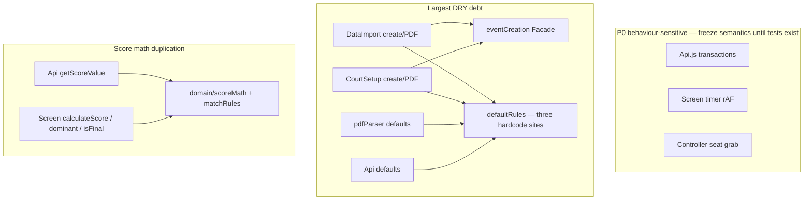

# Refactoring Plan — TKD Scoreboard

> **Status:** Phase 2 Waves 0–8 complete (planned P0 extracts done; smoke/PR still open).  
> **Branch:** `cursor/clean-code-refactor-8215`  
> **Base:** `main` @ `84fb26e`  
> **Completed:**  
> - Wave 0: Vitest + `npm test`  
> - Wave 1: `defaultRules` / `scoreMath` / `matchRules` → `Api` / `Screen` / `Edit`  
> - Wave 2: `matchFactory` / `eventCreation` → `CourtSetup` / `DataImport` / `pdfParser`  
> - Wave 3: Controller score-pad/params; Edit grid pieces; DecisionFlow Confirm + announcement timing  
> - Wave 4: Screen `formatTime` / `voteLogUtils` / `VoteLogRows` (timer rAF / Firebase listeners unchanged)  
> - Wave 5: `AuthContext` (Google only) + `EventSessionContext` (event/court); `AUTH_SESSION_KEY` workaround preserved  
> - Wave 6: `scoreTransaction` / `roundTransaction` pure bodies; `Api` thin Firebase wrappers (voteNow vs pauseNow clocks preserved)  
> - Wave 7: Screen `matchTimer` pure frame/toggle helpers; rAF + Firebase I/O stay in `Screen.jsx`  
> - Wave 8: Controller `seatGrab` helpers (J1→J3 order, 400ms delay const, claim tx, kick-out); Firebase orchestration stays in page

This document is the Phase 1 deliverable for a Clean Code / complexity-reduction refactor. Phase 2 (test-driven execution) must not start without approval.

---

## 0. Baseline facts

| Item | Status |
|------|--------|
| Source size | ~29 JS/JSX files under `src`, ~6.9k LOC |
| Unit tests | **0** test/spec files |
| `package.json` scripts | `dev` / `build` / `lint` / `preview` / deploy — **no `test`** |
| Test runners | No Vitest / Jest / Testing Library |
| Complexity metric | Decision-point heuristic (`if` / `for` / `case` / ternary / `&&` `\|\|`) for **file-level CC ranking** — not ESLint’s exact cyclomatic score, but sufficient to identify hotspots |

**Phase 2 prerequisite:** Add Vitest (and preferably Testing Library for components) plus an `npm test` script before changing any module under test.

---

## 1. Top 5 highest-complexity files

| Rank | File | ~LOC | ~File CC | Primary code smells |
|------|------|------|----------|---------------------|
| **1** | `src/Pages/Screen/Screen.jsx` | ~787 | **~157** | God component; ~11 `useEffect`s; timer rAF + Firebase listeners + vote UI + announcement orchestration; score/final-rule hardcodes duplicated vs `Api.js` |
| **2** | `src/Api.js` | ~447 | **~97** | Overloaded domain facade; long `updateScoreAndCheckRules` transaction; magic defaults (15 / 5 / 90 / 60 / 2); score weights `[1,2,3,4,6]`; IVR / TC / promotion mixed in one file |
| **3** | `src/Pages/DataImport/DataImport.jsx` | ~912 | **~89** | God page; ~34 `useState`s; Create Event + PDF + match CRUD + bracket; highly duplicated with CourtSetup |
| **4** | `src/Pages/CourtSetup/CourtSetup.jsx` | ~821 | **~76** | Auth gate + court session login + Create Event / PDF (~same as DataImport) + delete event; Google Auth coupled with court session |
| **5** | `src/Pages/Controller/Controller.jsx` | ~430 | **~76** | Seat-grab `runTransaction` + deep-link params + duplicated score-pad JSX; `sessionStorage` dual-track |

### Wave 2 candidates (after Top 5)

- `src/Pages/Screen/Edit.jsx` (~654 LOC, ~CC 74) — mirrored blue/red UI
- `src/Utils/pdfParser.js` — geometry magic numbers; third copy of default rules
- IVR / Technical Card Confirm + Announcement pairs — near-duplicate chrome
- `src/Context/AuthContext.jsx` — Context Split (Google Auth vs event/court session)

---

## 2. Cross-cutting smell map

### Risk grades (must follow during implementation)

| Grade | Zone | Handling |
|-------|------|----------|
| **P0** | `Api` transactions, Screen timer, Controller seat grab | Until tests exist: extract **pure helpers / thin wrappers only** — do **not** change semantics |
| **P1** | IVR / TC finalize side-effects, whole-event Firebase `set` | Require regression checklist before edits |
| **P2** | UI DRY, Auth / session split | Allowed after Wave 0 tests; still need smoke checks |

### Concrete smells by file (evidence)

#### `Screen.jsx`
- Local `calculateScore` duplicates `Api` score weights
- Dominant side hardcodes `gamjeom >= 5` instead of `config.rules.maxGamjeom`
- Final match hardcodes `roundWins === 2` instead of `roundsToWin`
- Oversized `renderVoteRows` (pending votes + success scores + icon map + direction reverse)
- Timer `requestAnimationFrame` + REST → `startNextRound` co-located with UI

#### `Api.js`
- `updateScoreAndCheckRules` — long `runTransaction` (vote window, multi-ref uniqueness, PTG / PUN)
- Defaults: `maxPointGap \|\| 15`, `maxGamjeom \|\| 5`, durations, `roundsToWin \|\| 2`
- Vote path uses server-time offset; some timer paths use bare `Date.now()` (clock inconsistency risk)
- IVR / TC / promote helpers share the same module

#### `DataImport.jsx` / `CourtSetup.jsx`
- Near-duplicate `handleFileSelect` / `handleCreateEvent` (multi-day PDF split)
- Magic rule defaults repeated in create + edit forms
- Empty match document shape hardcodes `state` / `stats` / `pointsStat`
- CourtSetup: mount `logout()` clears court session; Google auth + event session coupled in `AuthContext`

#### `Controller.jsx`
- Seat grab J1→J2→J3 + `onDisconnect` + StrictMode **400ms** delay (preserve)
- Score pad: ten near-identical buttons
- Param resolution: search / hash / `sessionStorage` fallbacks

---

## 3. Guiding principles (Clean Code)

1. **Single Responsibility (SRP)** — separate UI, domain rules, and Firebase I/O.
2. **DRY** — one source for default rules, score math, create-event flow, IVR/TC chrome.
3. **Small steps** — refactor **one function / one thin module** at a time; run tests after each change.
4. **Preserve edge logic** — do not delete workarounds that look redundant but are load-bearing (e.g. seat 400ms delay, vote window, last-10s avoiding penalty, Google `AUTH_SESSION_KEY`).
5. **Circuit breaker** — if tests for a module fail **more than twice in a row**, or an unrecoverable dependency error occurs: stop, `git restore` the affected files, report cause + options.

---

## 4. Phase 2 execution plan (after approval only)

### Wave 0 — Test infrastructure (mandatory first)

| Step | Work | Done when |
|------|------|-----------|
| 0.1 | Add Vitest (+ jsdom); optional React Testing Library | `npm test` exists |
| 0.2 | Write unit tests for the **first** pure modules to extract | Tests green on current behaviour |
| 0.3 | Document a short manual smoke checklist for P0 paths | Checklist reviewed |

**No P0 semantic edits before Wave 0 is green.**

### Wave 1 — Low-risk domain extraction (recommended first code batch)

| Step | Target | Pattern | Test focus |
|------|--------|---------|------------|
| 1.1 | `src/domain/defaultRules.js` | Extract Module | Single source of defaults |
| 1.2 | `src/domain/scoreMath.js` (`getScoreValue`) | Extract Module | Weights 1 / 2 / 3 / 4 / 6 |
| 1.3 | `src/domain/matchRules.js` (dominant / final / resolve) | Strategy / Extract Module | Read `maxGamjeom` / `roundsToWin` from config; remove Screen hardcodes `>= 5` / `=== 2` |
| 1.4 | Wire `Api.js` + `Screen.jsx` to domain modules | Thin Facade | Behaviour unchanged; public Api exports kept where possible |

### Wave 2 — Create Event DRY

| Step | Target | Pattern |
|------|--------|---------|
| 2.1 | `src/services/eventCreation.js` (form / PDF / multi-day split) | Facade |
| 2.2 | `src/services/matchFactory.js` (empty match shape) | Extract Module |
| 2.3 | Optional shared Create Event form component | Extract Component |
| 2.4 | Point `CourtSetup` + `DataImport` at Facade | Delete duplication |

### Wave 3 — Controller / Edit readability (avoid seat / scoring semantics)

| Step | Target | Pattern |
|------|--------|---------|
| 3.1 | Controller: params / device / score-pad config | Extract Module / Component |
| 3.2 | Edit: point types, side row, avoiding popup | Extract Component |
| 3.3 | Shared IVR / TC Confirm + Announcement shells | Extract Component (Template Method) |

### Wave 4 — Screen structure (still avoid timer semantic changes)

| Step | Target | Pattern |
|------|--------|---------|
| 4.1 | Vote log pure helpers + presentational rows | Extract Component |
| 4.2 | Optional: toasts / side history presentational | Extract Component |
| 4.3 | **Defer** `useMatchTimer` mega-hook unless timer unit/integration tests exist | — |

### Wave 5 — Auth vs EventSession (behaviour-sensitive; last)

| Step | Target | Pattern |
|------|--------|---------|
| 5.1 | `AuthContext` = Google only | Context Split |
| 5.2 | `EventSessionContext` = event / court + `sessionStorage` | Context Split |
| 5.3 | Manual checklist: Court Setup login, return clears session, QR deep-link | Regression |

### Wave 6 — Scoring / round transaction pure extract (P0 helpers)

| Step | Target | Pattern |
|------|--------|---------|
| 6.1 | `domain/scoreTransaction.js` + tests | Extract Method / Pure Domain — vote window, PUN/PTG, gamjeom |
| 6.2 | `domain/roundTransaction.js` + tests | Extract Method — declare winner / start next round |
| 6.3 | `Api.js` wrappers keep `runTransaction` + dual clocks | Facade — no semantic change |

### Wave 7 — Screen timer rAF pure extract (P0 helpers)

| Step | Target | Pattern |
|------|--------|---------|
| 7.1 | `Pages/Screen/matchTimer.js` + tests | Extract Method — frame resolve, pause/resume patches, ROUND expire patch |
| 7.2 | `Screen.jsx` rAF loop calls `resolveMatchTimerFrame` | Facade — keep `requestAnimationFrame` + Firebase side effects in page |
| 7.3 | Preserve REST → `startNextRound`; ROUND → finalize state | Regression |

### Wave 8 — Controller seat grab pure extract (P0 helpers)

| Step | Target | Pattern |
|------|--------|---------|
| 8.1 | `Pages/Controller/seatGrab.js` + tests | Extract Module — seat order, 400ms const, claim tx, kick detection |
| 8.2 | `Controller.jsx` uses helpers; keeps `runTransaction` / `onDisconnect` / delay | Facade — no semantic change |
| 8.3 | Preserve Admin non-seat path + unmount clear | Regression |

### Explicitly deferred (until strong tests)

- ~~Rewriting internals of `updateScoreAndCheckRules` transactions~~ → Wave 6 extracted pure bodies; Firebase wiring unchanged
- ~~Rewriting Screen timer rAF state machine~~ → Wave 7 extracted pure decisions; rAF loop shell unchanged
- ~~Rewriting Controller seat grab / `onDisconnect` order or delays~~ → Wave 8 extracted helpers; order/delay/`onDisconnect` orchestration unchanged

---

## 5. Per-file intended end state

| File | Intended direction |
|------|--------------------|
| `Screen.jsx` | Orchestration shell: listeners + timer stay; score/rules → domain; vote UI → component |
| `Api.js` | Thin facade re-exporting domain/services; keep stable public names |
| `DataImport.jsx` | Page orchestration only; creation/PDF → services |
| `CourtSetup.jsx` | Same shared services; auth/session split in Wave 5 |
| `Controller.jsx` | UI/params extracted; seat grab left semantically identical |

---

## 6. Success criteria

- [ ] `npm test` green
- [ ] `npm run build` green
- [ ] Top 5 files show clear LOC / decision-density reduction
- [ ] Scoring, match finalization, seat grab, PDF create-event behaviour verified unchanged (tests + smoke checklist)
- [ ] No silent deletion of known edge-case workarounds

---

## 7. Circuit breaker procedure

1. On **> 2 consecutive test failures** for the module under edit, or unrecoverable dependency errors:
2. **Stop** further edits to that module.
3. `git restore` the affected files (or revert the last commit on that slice).
4. Report: failure signature, suspected cause, recommended next options (narrower extract / more tests / abandon slice).

---

## 8. Approval gate

| Option | Meaning |
|--------|---------|
| Approve full plan | Start Phase 2 at Wave 0 |
| Approve Wave 0 + Wave 1 only | Domain extract first; defer Create Event / UI / Auth |
| Reorder waves | User specifies new priority |
| Reject / rewrite | Do not modify business code |

**Until one of the approve options is given, do not modify application source under `src/` for this refactor.**

---

## 9. Document history

| Date | Change |
|------|--------|
| 2026-08-10 | Phase 1 plan written from full-repo complexity scan; no `src/` changes |
| 2026-08-10 | Wave 6: score/round transaction pure extract + 24 new unit tests |
| 2026-08-11 | Wave 7: Screen matchTimer pure extract (rAF decisions + toggle patches) |
| 2026-08-11 | Wave 8: Controller seatGrab helpers (400ms / J1–J3 / kick-out) |
